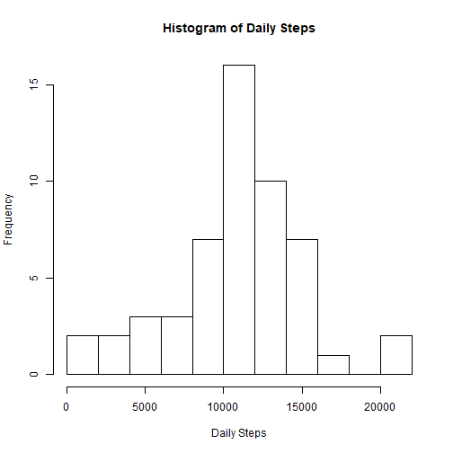
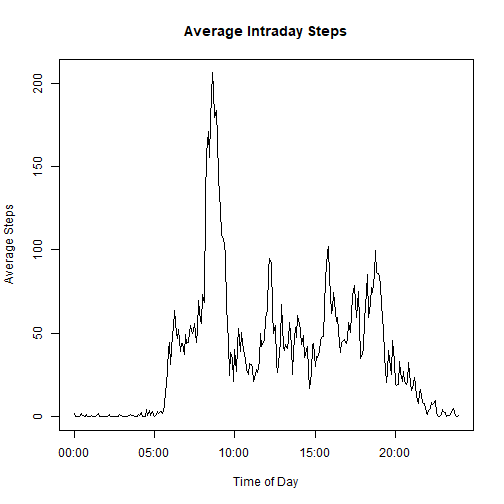
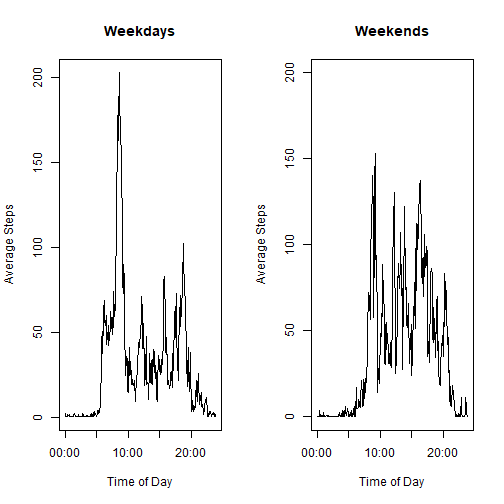

## Loading and Processing Data


First, the dataset was downloaded from https://d396qusza40orc.cloudfront.net/repdata%2Fdata%2Factivity.zip and stored as a data frame. Dates were then converted to Date format.


```r
library(lubridate)
data <- read.csv("activity.csv")
data$date <- ymd(data$date)
```

## Total Daily Steps

The total daily number of steps were calculated for each day in the two months period; the following histogram shows this distribution.


```r
library(dplyr)
sums <- data %>% group_by(date) %>% summarise_all(sum)
hist(sums$steps,breaks=10,xlab="Daily Steps",main="Histogram of Daily Steps")
```



The distribution has a mean value of 10766 steps and a median value of 10765 steps. ` as.integer(mean(sums$steps,na.rm=T))` and `median(sums$steps,na.rm=T)` were used to calculate these values, respectively.

## Average Daily Activity Pattern

The average number of steps taken per 5-minute interval was calculated, averaged across all days in the observation period. The time series plot of this data is below.


```r
avgs <- data %>% group_by(interval) %>% summarise(Average = mean(steps,na.rm=T))
avgs$interval <- as_datetime(hm(signif((avgs$interval/100),digits=4)))
plot(avgs$interval,avgs$Average,type="l",xlab="Time of Day",ylab="Average Steps",main="Average Intraday Steps")
```




```r
maxsteps <- avgs[which(avgs$Average==max(avgs$Average)),1]
maxtime <- hms::hms(as.numeric(maxsteps))
```

The five-minute interval with the maximum number of average steps is 8:35 - 8:40 AM.
`hour(maxtime)` and `minute(maxtime)` function calls were also used to calculate this interval.

## Imputing Missing Data

N/A values were identified in the data set and replaced with the average number of steps taken in the daily 5-minute interval, whose values were calculated previously. The following histogram shows this revised distribution.


```r
missing <- sum(is.na(data$steps))
for (n in 1:nrow(data)) {
    if (is.na(data$steps)[n]) {
        data[n,1] <- avgs[nrow(data)/61,2]
    }
}

sums2 <- data %>% group_by(date) %>% summarise_all(sum)
hist(sums2$steps,breaks=10,xlab="Daily Steps",main="Histogram of Daily Steps")
```


A total of 2304 N/A values were replaced.

This distribution has a mean value of 9394 steps and a median value of 10395 steps. ` as.integer(mean(sums2$steps,na.rm=T))` and `as.integer(median(sums2$steps,na.rm=T))` were used to calculate these values, respectively.

By imputing missing data, a large number of "low step count" days were introduced as most N/A values were replaced by average step count values from periods of low activity. This significantly lowered the mean value and slightly lowered the median value of the distribution.

## Weekdays vs. Weekends

A new factor variable was created in the original dataset denoting whether the data was collected on Weekdays (Monday-Friday) or Weekends (Saturday & Sunday). A panel of time series plots was created, similar to the previous aggregated plot above.


```r
data <- mutate(data,Weekday=ifelse(wday(data$date) %in% 2:6,"Weekday","Weekend"))
avgs <- data %>% group_by(interval,Weekday) %>% summarise(Average = mean(steps,na.rm=T))
avgs$interval <- as_datetime(hm(signif((avgs$interval/100),digits=4)))
weekdays <- subset(avgs, Weekday=="Weekday")
weekends <- subset(avgs, Weekday=="Weekend")
par(mfrow=c(1,2))
plot(weekdays$interval,weekdays$Average,type="l",xlab="Time of Day",ylab="Average Steps",main="Weekdays")
plot(weekends$interval,weekends$Average,type="l",xlab="Time of Day",ylab="Average Steps",main="Weekends",ylim=c(0,200))
```



